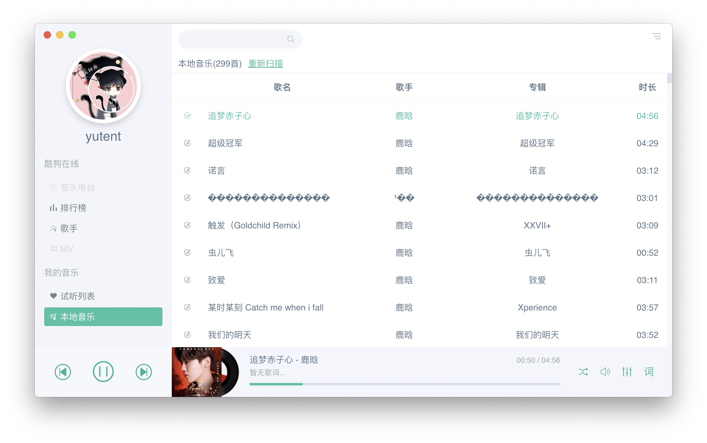
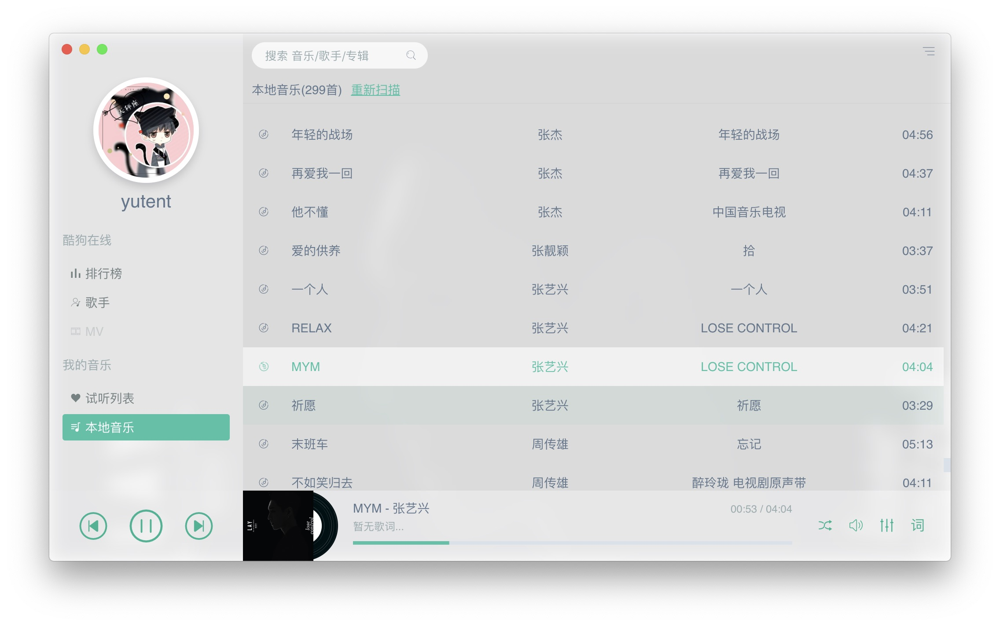
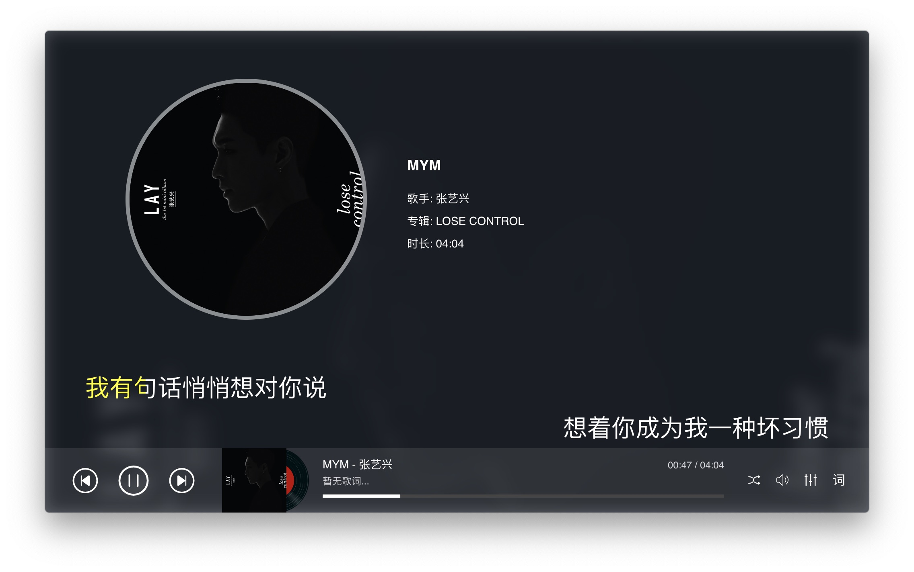

# Sonist 音乐播放器
> 一个音乐播放器, 主打本地音乐播放。支持 自动歌词/自动封面/均衡器等常见功能。
>> 同时利用酷狗音乐的API(**来源于网络,仅供学习使用**), 获取实时的云音乐(**仅免费的那部分,付费部分无法提供**)。


界面预览








## 开发计划

- [x] 主界面框架
- [x] 后台播放
- [x] 主题切换
- [x] 设置本地音乐目录
- [x] 缓存歌词
- [x] 自动获取专辑封面和歌词,自动更新ID3信息
- [x] 本地音乐
- [x] 设置界面
- [x] KTV模式
- [x] 歌曲ID3信息修改
- [x] 酷狗歌手列表(完成20%)
- [ ] 酷狗音乐排行榜
- [ ] 酷狗音乐MV
- [ ] 试听列表
- [ ] 均衡器
- [ ] 桌面歌词
- [ ] 迷你模式
- [ ] 多媒体快捷键
- [ ] 酷狗账号直接登录(犹豫中)
- [ ] 铃声制作(犹豫中)
- [ ] 用户评论/点赞(取决于登陆功能是否开发)
- [ ] ~~试听下载~~(不再提供下载)
- [ ] ~~歌曲质量选择~~(默认选择免费级中最高品质的mp3)
- [ ] 等你来建议


## 测试项目
> 目前项目还没 开发完成, 所以暂时没打包
>> 想体验的童鞋, 可以下载本项目源码, 然后执行以下命令(需要安装有nodejs环境)

```bash
cd project #你下载的项目所在的目录
npm i && npm start
```


## 捐助
> 开发app其实挺辛苦的。 喜欢我的作品的童鞋, 可以给我打赏个几块钱茶水费, 感激不尽。
>> 没钱的, 可以扫支付宝领红包, 也算支持我了。

 