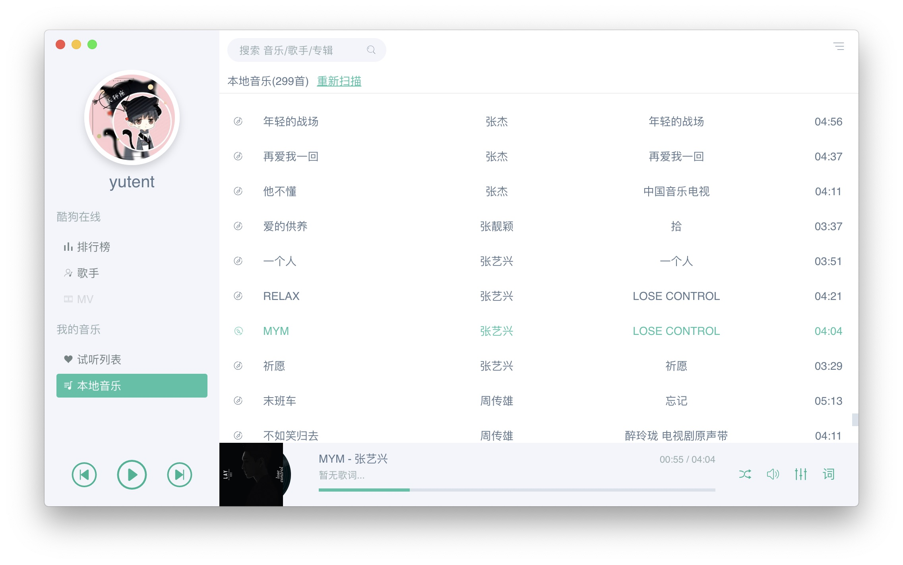

# Sonist 音乐播放器
> 一个音乐播放器, 主打本地音乐播放。支持 自动歌词/自动封面/均衡器等常见功能。
>> 同时利用酷狗音乐的API(**来源于网络,仅供学习使用**), 获取实时的云音乐(**仅免费的那部分,付费部分无法提供**)。

界面预览

## 开发计划

- [x] 主界面框架
- [ ] 酷狗音乐电台
- [ ] 酷狗音乐排行榜
- [ ] 酷狗歌手列表(完成20%)
- [ ] 酷狗音乐MV
- [ ] 试听列表
- [ ] 本地音乐(50%)
- [ ] 设置界面
- [ ] 均衡器
- [ ] 桌面歌词
- [ ] 迷你模式
- [ ] KTV模式
- [ ] 多媒体快捷键
- [ ] 酷狗账号直接登录(犹豫中)
- [ ] 铃声制作(犹豫中)
- [ ] 歌曲ID3信息修改(技术攻坚中)
- [ ] 用户评论/点赞(取决于登陆功能是否开发)
- [ ] 试听下载
- [ ] 歌曲质量选择
- [ ] 等你来建议

## 捐助
> 开发app其实挺辛苦的。 喜欢我的作品的童鞋, 可以给我打赏个几块钱茶水费, 感激不尽。
>> 没钱的, 可以扫支付宝领红包, 也算支持我了。